# T2A2 Readme - Jake Glasson

## R7 Identification of the problem you are trying to solve by building this particular marketplace app.

A website for refurbished laptops to fulfill the need for high end laptops that are affordable
  
## R8 Why is it a problem that needs solving?

individuals who are tight on money still need high end laptops. Newer high end laptops cost too much. 

## R9 A link (URL) to your deployed app (i.e. website)

https://refurbished-laptop-marketplace.herokuapp.com/

## R10 A link to your GitHub repository (repo).
	- Ensure the repo is accessible by your Educators

https://github.com/jakeiglasson/refurbished_laptop_marketplace

## R11 Description of your marketplace app (website):

Purpose:

* Allow seller to sell their refurbished laptops. Allow buyers who need high end laptops at an affordable price to be buy these refurbished laptops.

Functionality / features:

* user signup
* different user accounts (seller, not seller, admin)
* users request seller status, granted by admin
* admin panel for crud functionality over database
* laptop listing creation for sellers (selling laptops)
* ability for users to 'buy' laptops

Sitemap:

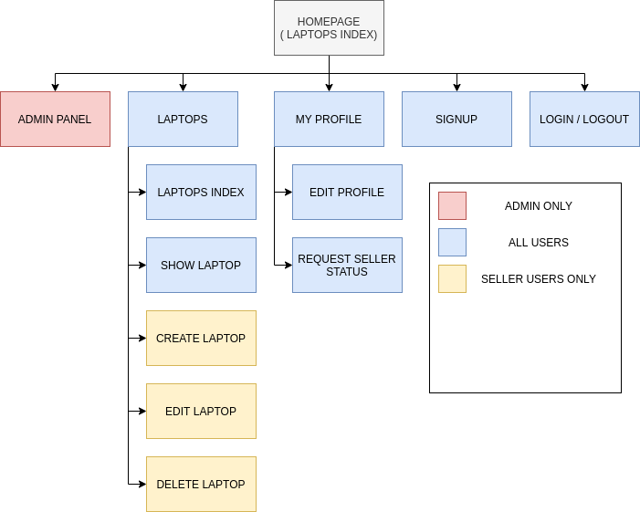

Screenshots:
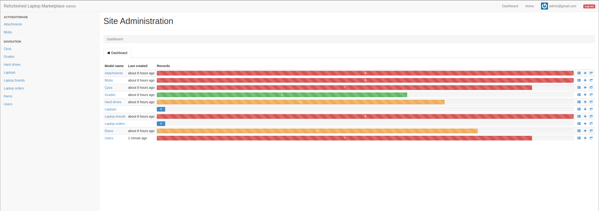
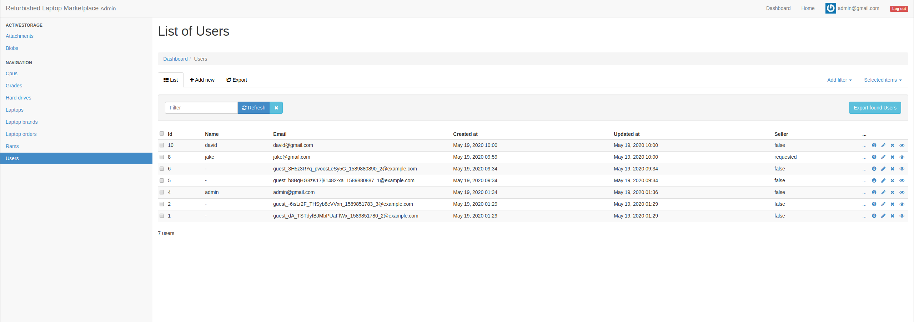
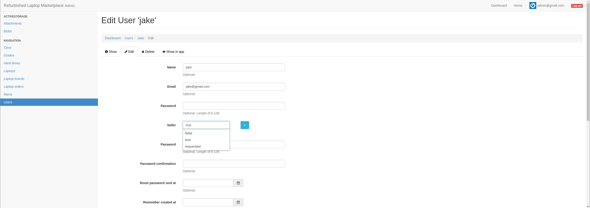
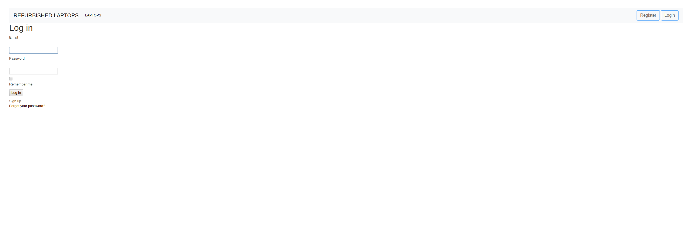
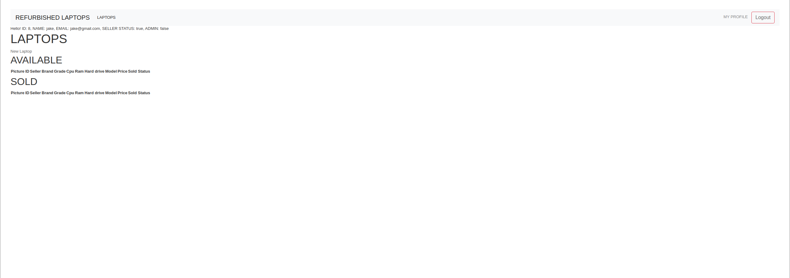
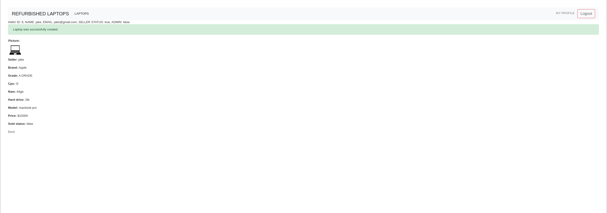
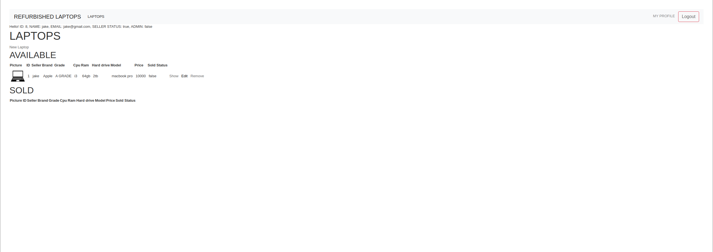
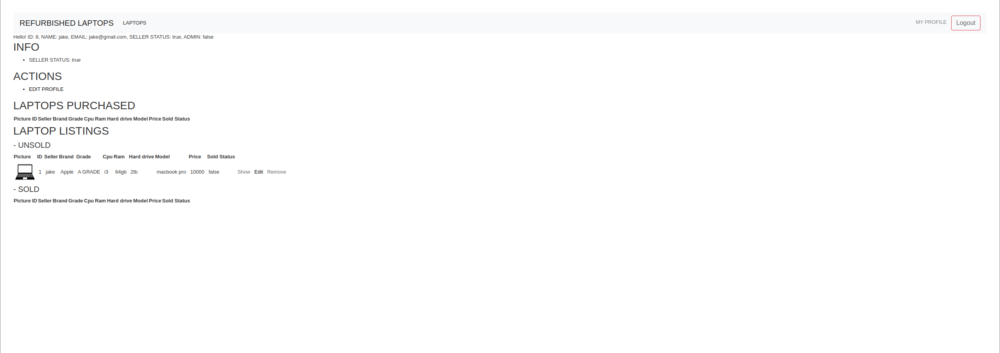
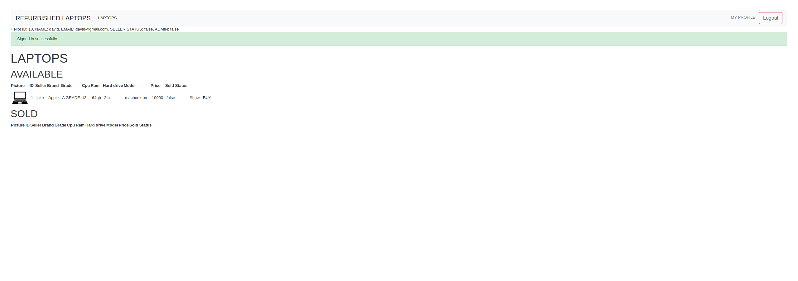
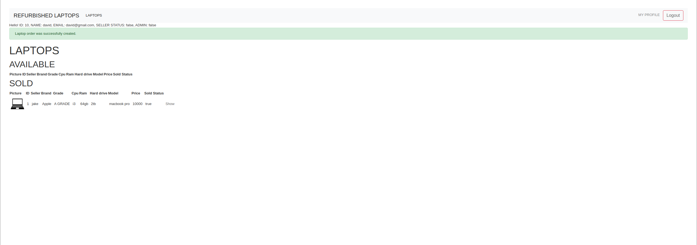
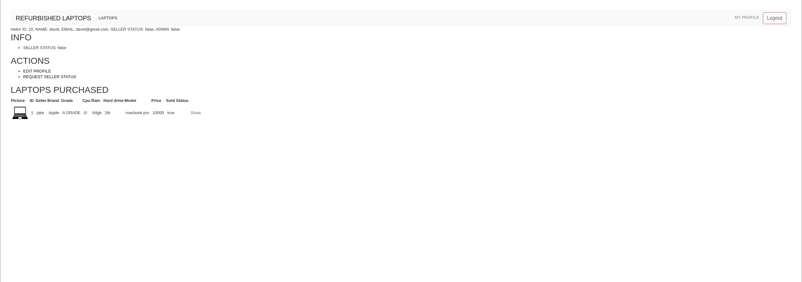

Target audience:

* Refurbished laptop resellers
* Individuals looking to buy power laptops at low prices

Tech stack (e.g. html, css, deployment platform, etc):

* Ruby on rails
* PotsgreSQL
* HTML
* CSS
* JAVASCRIPT
* AWS s3
* Deployment platform: Heroku

## R12 User stories for your app

buyer:

John needs a new laptop, he doesn't want to spend a lot of money on a new laptop but still wants a decent spec laptop that will be reliable. John discovers that you can get high grade refurbished laptops at a fraction of the cost new laptops go for with the same specs. John looks for a website that specializes in refurbished laptops and finds our app. John signs up for an account and buys a refurbished laptop.

seller:

Jane has a laptop that's a few years old, has a few scuffs and damages, in the current condition its in she doesn't believe she would be able to sell it and get a fair price. Jane discovers that she can send her laptop to our company to have the laptop refurbished and sold. Jane creates an account with us, sends in her laptop (the laptop is refurbished by us into a sell-able condition), once refurbished her laptop appears under her account ready to be sold. Once sold our company takes a cut and Jane receives her money minus shipping costs.

## R13 Wireframes:

Desktop Wireframes

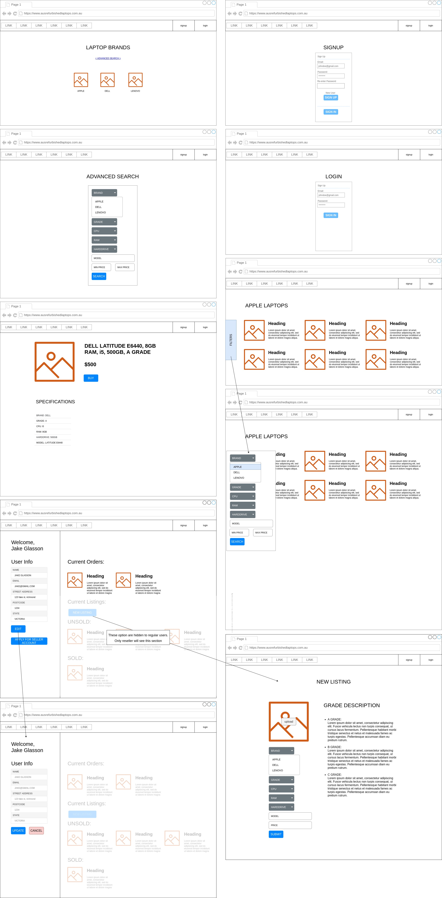

Mobile and Tablet Wireframes:

## R14 ERD:

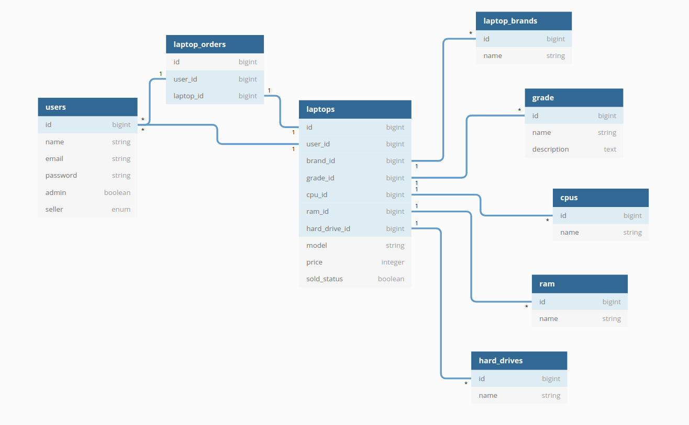

## R15 Explain the different high-level components (abstractions) in your app:

Active Record:

Active Record is a high level component that facilitates easy access and modifications to our database. Models inherit from Active Record which Inherits from the base facilitating the use of SQL commands.

Essentially this means that inside our models, active record can be called to perform actions such as create, read, update and delete. In the background Active Record executes the SQL to perform modifications requested in the model.

Active Storage:

Active view / Action View:

## R16 Detail any third party services that your app will use:

AWS S3:

* Used to store images using AWS S3

Faker:

* Was used to help seed the database with placeholder data during production

Devise:

* Devise is used in the project to create user accounts and take a lot of the hard work out of managing these accounts.  

* Devise allows for accessing current user information between requests by handling the cookies and sessions.  

* By using devise I was able to restrict certain content based on whether a user was logged in or not.

Devise Guests:

* Used in combination with devise. Allows the generation of guest accounts when a user accesses the app while not logged in.

* Allows certain functionality such as buying items that is impossible without an account but still possible using a guest account

Cancancan:

* Cancancan is used in the project to restrict access to only those users who have the right privileges 

* Using Cancancan admins have access to all functions and the admin panel. 

* Via Cancancan all users can only perform crud on their own details, view laptop entries and buy a laptop they didn't list. 

* Via Cancancan seller users can list new laptops and have full crud over unsold laptops

Rails Admin:

* Gives access to an admin panel which provides full crud over all tables and entries in the database.

## R17 Describe your projects models in terms of the relationships (active record associations) they have with each other

## R18 Discuss the database relations to be implemented in your application

## R19	Provide your database schema design

## R20	Describe the way tasks are allocated and tracked in your project

Tools Used:

* Trello

Process:

* Ideas / features / improvements are placed in a card call Braindump. 

* From this they are sorted into two columns; NICE TO HAVE and TODO

* The NICE TO HAVE card is for nonessential features that would improve the app but aren't necessary to produce an MVP

* The TODO card consists of features that need to be implemented

* Everyday, features are assigned to be completed from the TODO card, these are placed in the DOING card

* Any work that is postponed is placed in the IN PROGRESS card

* Once a feature is finished it is placed in the DONE / NEEDS TESTING card

* Once a feature is fully tested and deemed working, it is placed in the DONE card

* When work is interrupted, a brief desrciption of what you were working on is placed in the WHAT YOU WERE WORKING ON BEFORE YOU STOPPED card. What work to commence when the interruption is gone is placed in the WHAT TO DO WHEN YOU GET BACK card.

